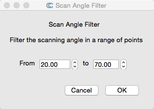
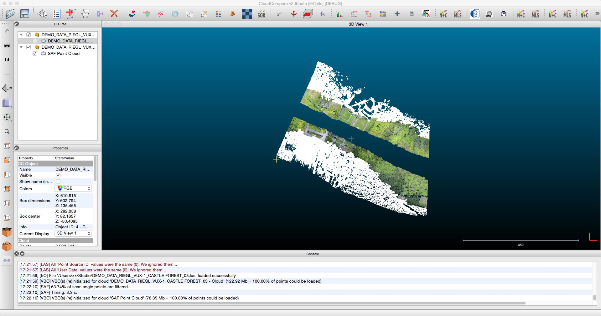

# qSAF

qSAF(Scan Angle Filter) is a simple CloudCompare plugin that can filter a given range of scanning angles.

It is only suitable for LAS format point cloud file.

## CloudCompare

[CloudCompare](https://github.com/CloudCompare/CloudCompare)
 is an open source 3D point cloud and grid processing software that can handle all kinds of point cloud format data.

## CloudCompare-Qt

[CloudCompare-Qt](https://github.com/huihut/CloudCompare-Qt) is a third-party Qt project built on the source code of CloudCompare. It only needs Qt to compile and run witout Visual Studio, and support Windows, MacOS, and Linux.

## Use qSAF in CloudCompare

#### Put qSAF to CloudCompare

    mkdir CloudCompare
    cd CloudCompare
    git clone --recursive https://github.com/cloudcompare/trunk.git
    git clone https://github.com/huihut/qSAF.git trunk/plugins/qSAF
    rm -rf trunk/plugins/qSAF/.git

#### Generate / Run

[Generating CloudCompare project](https://github.com/CloudCompare/CloudCompare/blob/master/BUILD.md#generating-the-project)

## Use qSAF in CloudCompare-Qt

[CloudCompare-Qt](https://github.com/huihut/CloudCompare-Qt)

## Tutorial

Tutorial on how to write a CloudCompare plugin.

1. [CloudCompare插件编写一（插件框架）](http://blog.huihut.com/2017/04/27/CloudCompareSAFPlugin_1_Framework/)
2. [CloudCompare插件编写二（数据结构）](http://blog.huihut.com/2017/04/27/CloudCompareSAFPlugin_2_DataStructure/)
3. [CloudCompare插件编写三（算法实现）](https://blog.huihut.com/2017/04/27/CloudCompareSAFPlugin_3_Algorithm/)

## Screenshot

## License

[MIT](https://github.com/huihut/qSAF/blob/master/LICENSE)
